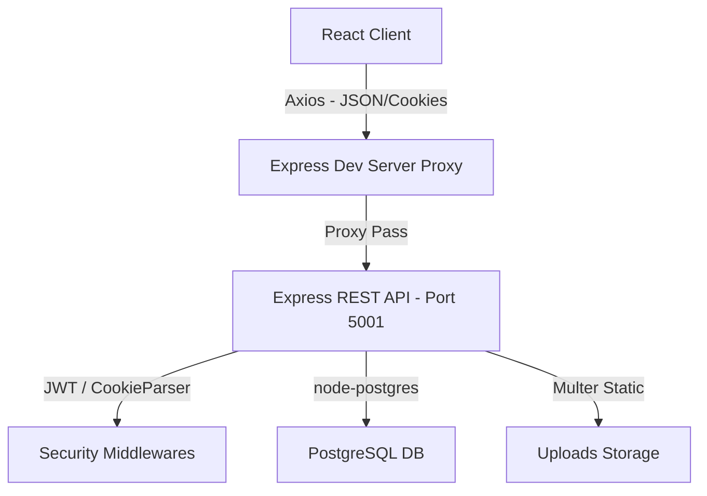

# PeopleSync EMS (Employee Management System)

PeopleSync EMS is a modern, unified administrative portal and recruitment pipeline tailored for streamlined corporate operations. Built with a robust **React + Node.js (Express) + PostgreSQL** stack, it features secure session controls, dynamic data visualizations, automated leave workflows, asset tracking, and a seamless career intake application.

---

## 🌟 Key Features

### 1. Operations Dashboard & Live Analytics
* **Interactive Data Visualizations**: Interactive graphs built with `Recharts` providing deep business insights.
* **Smart Legends (Department Distribution)**: Designed with custom split legends (left and right columns) surrounding the Pie Chart to prevent overlapping and text clutter.
* **Responsive Visuals**: Responsive SVG container scaling that adapts dynamically to both **Light Theme** (deep indigo/black labels) and **Dark Theme** (soft white/lavender labels) using reactive CSS custom properties.
* **Theme Styling**: Features custom-tailored light purple (`#a78bfa`) and pink (`#f472b6`) colors for the Stacked Bar chart to align with the modern glassmorphism design language.

### 2. Streamlined Recruitment Pipeline
* **Talent Portal Intake**: Clean external onboarding intake form renamed dynamically to **"Apply Now"** for Job and Internship applications.
* **Active Department Integration**: Automatically loads department entries dynamically from the backend with a fallback layout for offline presentation.
* **Contrast-Optimized Forms**: Explicit high-contrast dropdown option elements styled specifically for Chrome and Safari browsers to ensure maximum visibility in dark and light themes.

### 3. Integrated Leaves & Attendance System
* **Leave Management**: Tracks leave balances (Casual, Sick, Earned, Maternity) for employees with automatic offset rules.
* **Multi-Stage Approvals**: Structured workflow allowing Managers to review and HR to finalize leave requests, logged under a detailed approval history schema.
* **Attendance Tracking**: Punch logs, regular logins, and monthly attendance records linked directly to the payroll engine.

### 4. Smart Asset & Documentation Inventory
* **Inventory Control**: Allocates and releases corporate assets (Laptops, Mouse, Monitors, software licenses, security badges) to employees.
* **Log Verification**: Auditable transaction logs tracking asset allocation, return dates, and remarks.
* **File Uploads**: Supports avatar profile pictures, CV/resumes, and additional documents served securely via static uploads middleware.

---

## 🛠 Tech Stack & Architecture



### Frontend Architecture
* **Core**: React 19, JavaScript (ES6+), Vanilla CSS.
* **Routing & State**: Interactive panels, tab switching, and inline session tracking.
* **Libraries**: `axios` (configured with relative baseURL for setupProxy routing), `recharts` for charts, `framer-motion` for transitions, and `react-icons`.

### Backend Architecture
* **Core**: Node.js, Express.js (Modular Router structure).
* **Database client**: `pg` (Node-Postgres) pooling.
* **Security & Authentication**:
  * `jsonwebtoken` (JWT) for secure authentication.
  * `bcrypt` for password hashing.
  * `helmet` security headers.
  * `cookie-parser` for HttpOnly secure cookie exchange.
  * `express-rate-limit` to prevent brute force.

---

## 🚀 Getting Started

### 1. Prerequisites
Ensure you have the following installed locally:
* **Node.js** (v18 or higher recommended)
* **npm** (v9 or higher)
* **PostgreSQL** database server running locally

### 2. Environment Configuration
Set up your environment parameters by verifying your connection variables.

Create a `.env` file inside the `backend` directory:
```env
DB_USER=postgres
DB_PASSWORD=your_postgres_password
DB_HOST=localhost
DB_DATABASE=loginapp
DB_PORT=5432
PORT=5001
JWT_SECRET=supersecretjwtkey
```

### 3. Database Migration & Seeding
Start your local PostgreSQL instance and run the seeding script. The database server will automatically execute table initialization queries defined in `db.js` on boot.
To populate the tables with a comprehensive demo dataset of 114 users, profiles, and attendance/leave metrics, run:
```bash
cd backend
npm run fetch-employees # Runs seeding procedures
```
Alternatively, execute direct seed via:
```bash
node scripts/seed.js
```

### 4. Running the Servers Locally
To run the full workspace stack locally:

#### Step A: Run the Express Backend
```bash
cd backend
npm install
npm start
```
The server will start listening on `http://localhost:5001`.

#### Step B: Run the React Frontend
```bash
cd ../frontend
npm install
npm start
```
The development server will open `http://localhost:3000` in your browser. All requests starting with `/api` and `/uploads` will be automatically forwarded to the backend on port `5001` via the `http-proxy-middleware` configured in `setupProxy.js`.
